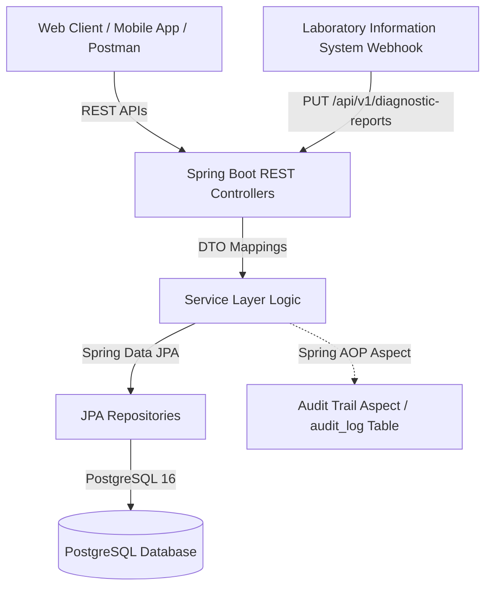
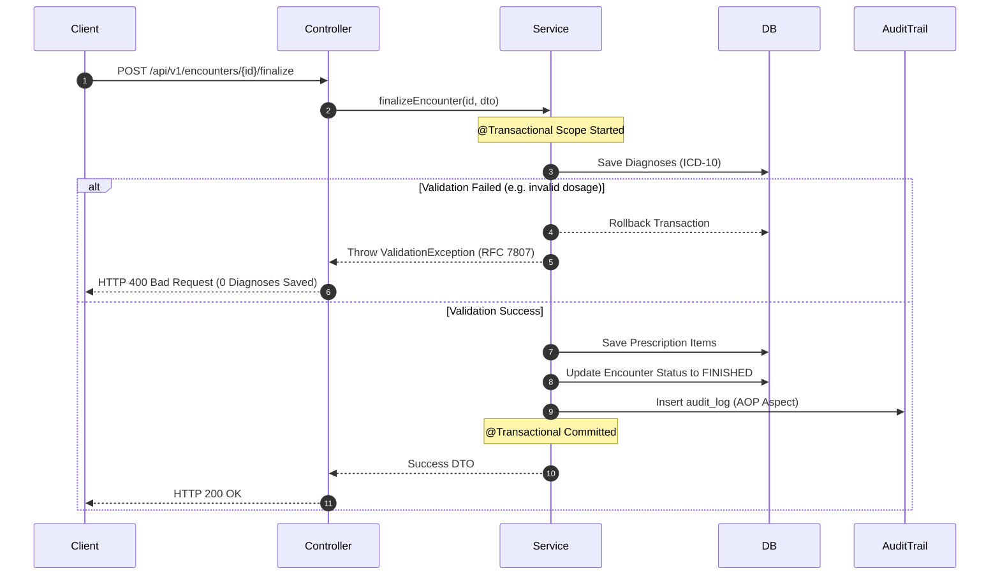
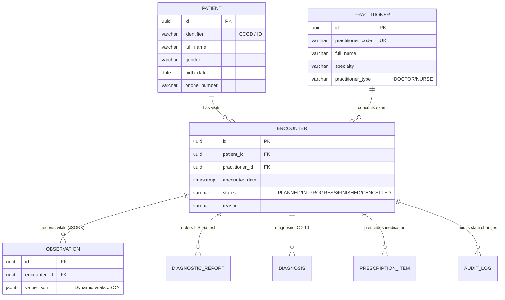

# 🏥 OmniCare EMR — Enterprise Electronic Medical Record Core Backend API

[](https://github.com/nhanltd/OmniCare-EMR/actions/workflows/ci.yml)
[](https://github.com/nhanltd/OmniCare-EMR/actions/workflows/codeql.yml)


**OmniCare EMR** is an enterprise-grade, high-performance Electronic Medical Record (EMR) core backend system developed with **Spring Boot 3**, **Java 17+**, **PostgreSQL 16** (utilizing native JSONB column storage), **Flyway database migrations**, and **Spring AOP audit trail logging**.

It implements clinical workflows, laboratory LIS webhooks, transactional examination finalizations with full ACID rollback, and real-time operational intelligence analytics.

---

## 📋 Table of Contents

- [Key Architecture & Design Highlights](#-key-architecture--design-highlights)
- [System Architecture & Flow](#-system-architecture--flow)
- [Database Entity Relationship Diagram (ERD)](#-database-entity-relationship-diagram-erd)
- [Phase-by-Phase Roadmap](#-phase-by-phase-roadmap)
- [API Endpoints Reference](#-api-endpoints-reference)
- [Getting Started & Installation](#-getting-started--installation)
- [Postman API Collection](#-postman-api-collection)
- [Automated Testing & CI/CD](#-automated-testing--cicd)
- [Security & Compliance Audit](#-security--compliance-audit)
- [License & Contributing](#-license--contributing)

---

## 🌟 Key Architecture & Design Highlights

1. **Flexible Vitals Storage via Native PostgreSQL `JSONB`**:
   - Stores dynamic physiological measurements (Blood Pressure, Heart Rate, Temperature, SpO2) inside a JSONB column without schema modifications.
2. **ACID Transactional Examination Finalization & Rollback**:
   - Atomic `@Transactional` execution when recording ICD-10 Diagnoses and Prescriptions simultaneously. If any item fails validation, the entire transaction automatically rolls back.
3. **Spring AOP Cross-Cutting Audit Logging**:
   - Intercepts encounter status transitions (`PLANNED` ➔ `IN_PROGRESS` ➔ `FINISHED` / `CANCELLED`) automatically using `@Aspect`, inserting immutably into `audit_log`.
4. **Real-time Operational Intelligence & Clinical History**:
   - Calculates lab Turnaround Time (TAT) in minutes, active visit distributions, top ICD-10 diagnostic trends, and consolidated patient medical timeline views.

---

## 🏗️ System Architecture & Flow



### Finalize Exam Transaction Flow (ACID & Rollback Guarantee)



---

## 🗄️ Database Entity Relationship Diagram (ERD)



---

## 🚀 Phase-by-Phase Roadmap

| Phase | Module Name | Scope & Technical Implementation | Flyway Script |
| :--- | :--- | :--- | :--- |
| **Phase 1** | Administrative Core | Practitioner & Patient CRUD APIs, UNIQUE constraints, Base Entity | `V1__init_schema.sql`<br>`V2__create_practitioner_table_and_seed.sql` |
| **Phase 2** | Clinical Core | Encounter status state machine, JSONB column storage for Vitals | `V3__create_encounter_and_observation_tables.sql` |
| **Phase 3** | LIS Webhook & Finalize | LIS Webhook API, Transactional Finalize with Rollback, AOP Audit | `V4__phase3_schema.sql` |
| **Phase 4** | Operational Analytics | Operational KPIs, Lab TAT calculations, Patient Timeline, Flyway Seed Data | `V5__analytics_indexes.sql`<br>`V6__seed_full_demo_data.sql` |

---

## 📡 API Endpoints Reference

### 1. Administrative APIs (`/api/v1`)
- `GET /api/v1/practitioners` — List all active medical practitioners.
- `POST /api/v1/practitioners` — Create a new practitioner (Doctor / Nurse / Technician).
- `GET /api/v1/patients/{id}` — Get patient demographics by ID.
- `POST /api/v1/patients` — Register a new patient with CCCD validation.

### 2. Clinical Core APIs (`/api/v1`)
- `POST /api/v1/encounters` — Book a planned medical encounter.
- `GET /api/v1/encounters/{id}` — Retrieve encounter details.
- `POST /api/v1/observations` — Record physiological vitals into JSONB.
- `GET /api/v1/observations?encounterId={id}` — Retrieve vitals by encounter ID.

### 3. LIS & Finalization APIs (`/api/v1`)
- `PUT /api/v1/diagnostic-reports/{id}/results` — LIS Webhook endpoint for laboratory test results.
- `POST /api/v1/encounters/{id}/finalize` — Atomically finalize examination, add ICD-10 diagnoses & prescriptions.

### 4. Operational Intelligence APIs (`/api/v1`)
- `GET /api/v1/analytics/operational-kpis` — Real-time operational metrics, lab TAT, encounter status breakdown.
- `GET /api/v1/patients/{id}/clinical-history` — Consolidated chronological patient medical history timeline.

---

## ⚙️ Getting Started & Installation

### Prerequisites
- **Java JDK 17+** (Tested on Java 17, 21, and 25)
- **Apache Maven 3.8+**
- **Docker & Docker Desktop**

### 1. Start Database Infrastructure
```bash
docker-compose up -d
```
*Starts PostgreSQL 16 container `omnicare-postgres` listening on port `5432`.*

### 2. Compile & Launch Application
```bash
cd omnicare-emr-api
mvn clean spring-boot:run
```

The server will initialize Flyway database migrations automatically and listen on port **`8686`**:
- **Swagger UI Interactive Docs**: 👉 `http://localhost:8686/swagger-ui/index.html`
- **OpenAPI 3.0 Specs JSON**: 👉 `http://localhost:8686/v3/api-docs`

---

## 📬 Postman API Collection

A complete, pre-configured Postman Collection file is available in the root folder:
📁 `OmniCare_EMR_Postman_Collection.json`

### How to Import into Postman:
1. Open Postman.
2. Click **Import** or drag and drop `OmniCare_EMR_Postman_Collection.json` into Postman.
3. The environment variable `baseUrl` is set to `http://localhost:8686`.

---

## 🧪 Automated Testing & CI/CD

The project enforces strict automated testing quality standards across 79 comprehensive integration and unit tests.

### Running Test Suite
```bash
cd omnicare-emr-api
mvn test
```

### Build & Test Output
```text
[INFO] Results:
[INFO] Tests run: 79, Failures: 0, Errors: 0, Skipped: 0
[INFO] ------------------------------------------------------------------------
[INFO] BUILD SUCCESS
[INFO] ------------------------------------------------------------------------
```

---

## 🛡️ Security & Compliance Audit

- **No Hardcoded Secrets**: Scanned and verified clear of private keys, JWT secrets, or third-party cloud credentials.
- **RFC 7807 Error Handling**: Standardized problem details structure for all exceptions.
- **Optimistic Locking & Soft Delete**: Every domain entity contains `@Version` and `is_deleted` flags to preserve medical data integrity.

---

## 📜 License & Contributing

Distributed under the **Apache 2.0 License**. See [LICENSE](LICENSE) for more information.

Contributions are welcome! Please read [CONTRIBUTING.md](CONTRIBUTING.md) for details on our code of conduct and the process for submitting Pull Requests.
